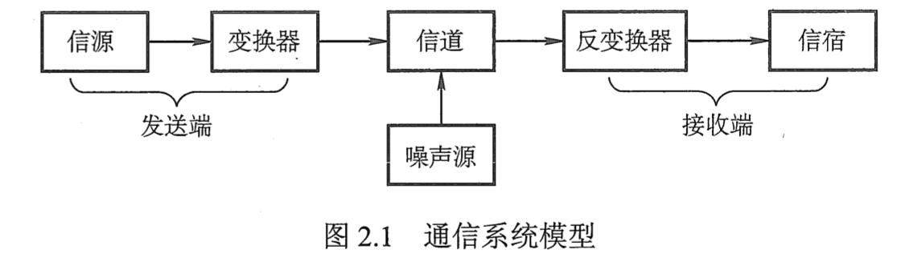

# 信道、信号、带宽、码元、波特、速率、信源与信宿等基本概念

通信的目的是在信源和信宿之间传送**消息(message)**。消息可以是语音、文字、图像、视频等各种信息表现形式，而 **数据(data)** 是承载和传递消息的实体。数据是经过特定方式编码后的信息，通常表现为有意义的符号序列或二进制序列。

## 1. 数据

**数据**是用于表示消息的符号序列或比特序列。在计算机网络中，数据通常以二进制的形式表示，即由“0”和“1”组成的比特序列。数据可以表示文字、音频、视频、图像等各种信息。

## 2. 信号

**信号(signal)** 是数据的电气或电磁表现形式。信号用于在传输介质上传递数据，根据信号的不同形式，可以将其分为以下两类：

- **模拟信号（或连续信号）** ：信号的参数（如幅度、频率、相位等）的取值是连续的。在模拟信号中，代表信息的物理量在一个范围内可以取任意值。例如，声音在空气中的传播是一种模拟信号。

- **数字信号（或离散信号）** ：信号的参数的取值是离散的。在数字信号中，信息用有限的、离散的电平表示，通常是二进制形式（如0和1）。数字信号在现代计算机网络中应用广泛。

此外，根据信号的频谱范围和传输方式，信号可以进一步分为基带信号和宽带信号：

- **基带信号** 是原始的未经过调制的信号，通常直接表示数据的形式，如计算机输出的二进制数据流直接用不同的电压来表示。基带信号的频率范围从零开始，并且其最高频率通常等于其数据速率。基带信号通常用于短距离的有线传输，例如以太网。

- **宽带信号** 则是经过调制后的信号，频率范围较宽，适合在更高频率上传输数据。宽带信号常用于远距离的有线或无线传输，例如通过调制将基带信号转换为高频信号，以适应长距离传输需求。

> 基带信号使用不同的电压表示数字信号0和1，然后送到数字信道上运输，称为**基带传输**，宽带信号首先将基带信号进行调制，形成频分复用模拟信号，然后送到模拟信道上进行传输，称为**宽带传输**。

## 3. 信道

**信道(channel)** 是传输信号的介质或路径，一般用来表示向某个方向传送信息的媒体，因此一条通信电路一般包含一条发送信道和一条接收信道。信道按传输介质分类，可以是有线信道（如双绞线、电缆、光纤）或无线信道（如无线电波、微波）；按传输信号形式的不同，信道分为传输模拟信号的模拟信道和传输数字信号的数字信道。信道的主要功能是将信号从发送端传递到接收端。在信道上传输信号时，可能会受到噪声、干扰和衰减等影响，导致信号的失真或丢失。

从通信的双方信息交互的方式来看，可以有以下三种基本方式:

1. 单向通信：又称为单工通信，即只能有一个方向的通信而没有反方向的交互。无线电广播或有线电广攝以及电视广攝就属于这种类型。
2. 双向交替通信：又称为半双工通信，即通信的双方都可以发送信息，但不能双方同时发送(当然也就不能同时接收)。这种通信方式是一方发送另一方接收，过一段时间后可以再反过来。
3. 双向同时通信：又称为全双工通信，即通信的双方可以同时发送和接收信息。单向通信只需要一条信道，而双向交替通信或双向同时通信则都需要两条信道(每个方向各一条)，显然，双向同时通信的传输效率最高。

> 有时人们也常用“单工”这个名词表示“双向交替通信”，如常说的“单工电台”并不是只能进行单向通信。正因为如此，ITU-T才不采用“单工”“半双工”和“全双工”这些容易弄混的术语作为正式的名词。
> 数据传输方式分为串行传输和并行传输。串行传输是指逐比特地按序依次传输，并行传输是指若干比特通过多个通信信道同时传输。`串行传输适用于长距离通信，如计算机网络。`并行传输适用于近距离通信，常用于计算机内部，如CPU 与主存之间。

## 4. 带宽

**带宽(bandwidth)** 通常有两个含义：

1. 在模拟信号系统中是指信道能够传输的信号频率范围，即最高频率与最低频率只差，通常以赫兹（Hz）为单位表示。
2. 在通信中，带宽也常用于表示单位时间内传输数据的最大速率，通常以比特每秒（bps或b/s）为单位。带宽越大，信道的传输能力越强，可以传输更高的数据速率。

## 5. 码元

**码元(symbol)** 是信号的基本单位，每一个码元代表了若干比特的数据。码元的取值决定了数字信号的具体形式。常见的码元形式包括电压、电流、频率等不同的电气信号。

> 码元与比特的区别？
>
> - 码元是用于表示信息的最小单元。在数字通信系统中，码元可以是一个电压水平、一段时间的光脉冲、或者任何能够在通信系统中传输和被接收的信号。
>
> - 比特是信息的最小单位，它只能表示两种状态之一，通常用0和1来表示。一个比特可以看作是一个简单的“开”或“关”状态、一个“是”或“否”的决定、或者是“0”和“1”中的一个。
>
> - 码元和比特是不同的概念，但它们之间有关系。一个码元可以包含一个或多个比特。比如，在一个通信系统中，假设一个码元有4种不同的状态（比如4种不同的电压），那么这些状态可以用2个比特（00、01、10、11）来表示。因此，一个码元可能包含多个比特信息。
>
> - 如果一个码元有n种状态，则其最多可以表示出\\(log_2(n)\\)位比特数。
>

## 6. 波特

**波特 (Baud)** 是码元传输速率的单位，表示每秒钟传输的码元数。一个码元可以表示一个或多个比特，因此波特率与数据速率（比特率）密切相关，但两者并不完全相同。波特率仅指每秒钟传输的码元数，而数据速率则考虑了每个码元所表示的比特数。如果一个码元表示多个比特，则数据速率（比特率）会高于波特率。例如，在一个调制方式中，每个码元表示2个比特，那么如果波特率是1000波特，数据速率将是2000 bps。

## 7. 速率

**速率 (Rate)** 在通信中通常指**数据速率 (Data Rate)**，即单位时间内传输的数据量。速率通常以比特每秒（bps）为单位表示。数据速率包括两个重要的概念：

- **码元传输速率 (Symbol Rate)**：也称为波特率，表示每秒钟传输的码元数量，单位为波特（Baud）。码元传输速率决定了信号的基本传输速率，但不直接反映传输的实际信息量。

- **信息传输速率 (Information Rate)**：也称为比特率，表示每秒钟传输的比特数，单位为bps（比特每秒）。信息传输速率考虑了每个码元中携带的比特数，因此比特率通常等于码元传输速率乘以每个码元携带的比特数。信息传输速率直接影响通信的效率和传输质量。

## 8. 信源与信宿

**信源(source)** 是产生和发送消息的设备或系统，而 **信宿(destination)** 是接收和处理消息的设备或系统。在一个通信系统中，信源和信宿之间通过信道进行数据传输。信源生成数据并将其转换为信号，通过信道传输到信宿，信宿接收到信号并将其解码还原为原始数据。

