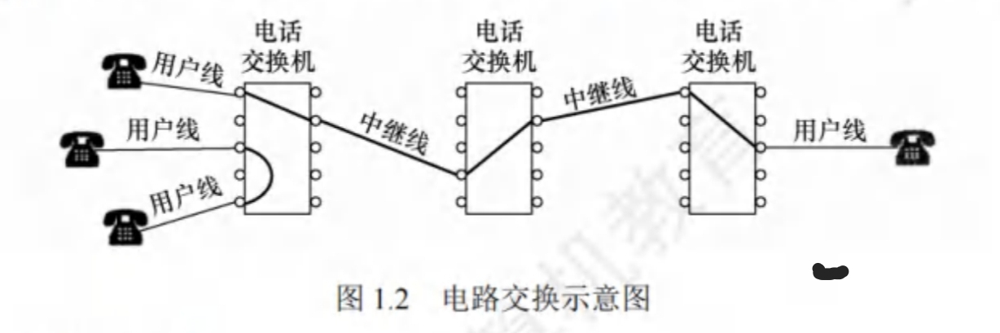
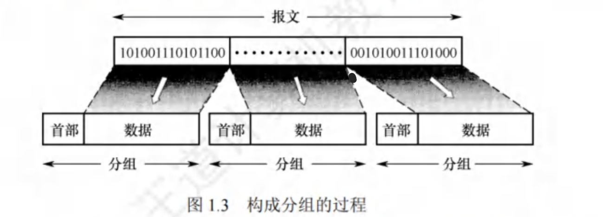
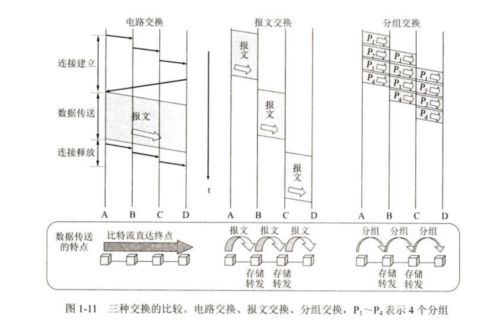

# 电路交换、报文交换与分组交换

在网络核心部分起重要作用的是路由器(router)，它对收到的分组进行存储转发来实现分组交换。要了解分组交换的原理，首先就要学习电路交换的相关概念。

## 1. 电路交换

### (1)电路交换的概念

最典型的电路交换网是传统电话网，如下图所示。从通信资源分配的角度看，交换就是按照某种方式动态地分配传输线路的资源。电路交换分为三步：连接建立、数据传输和连接释放。在进行数据传输前，两个结点之间必须先建立一条专用(双方独占)的物理通信路径(由通信双方之间的交换设备和链路逐段连接而成)，该路径可能经过许多中间结点。在数据传输过程中，这一物理通信路径始终被用户独占，直到通信结束后才被释放。

在电路交换的整个通信阶段，比特流连续地从源点直达终点，就好像在一个管道中传送。

### (2)电路交换的优点

1. 通信时延小。因为通信线路为通信双方专用，数据直达，所以传输时延非常小。
2. 有序传输。双方通信时按发送顺序传送数据，不存在失序问题。
3. 没有冲突。不同的通信双方拥有不同的信道，不会出现争用物理信道的问题。
4. 适用范围广。电路交换既适用于传输模拟信号，又适用于传输数字信号。
5. 实时性强。通信双方之间的物理通路一旦建立，双方就可随时通信。
6. 控制简单。电路交换的交换设备(交换机等)及控制均较简单。

### (3)电路交换的缺点

1. 建立连接时间长。电路交换的平均连接建立时间对计算机通信来说太长。
2. 线路利用率低。物理通路被通信双方独占,即使线路空闲,也不能供其他用户使用。
3. 灵活性差。物理通路中的任何一点出现故障,就必须重新拨号建立新的连接。
4. 难以规格化。不同类型、不同规格、不同速率的终端很难相互进行通信。
5. 难以实现差错控制。中间结点不具备存储和检验数据的能力,无法发现并纠正错误

## 2. 报文交换

### (1)报文交换的概念

数据交换的单位是报文，用户数据加上源地址、目的地址等信息后，后封装成报文(message)。报文交换采用存储转发技术，整个报文先传送到相邻的结点，全部存储后查找转发表，转发到下一个结点，如此重复，直至到达目的结点。每个报文都可单独选择到达目的结点的路径。

### (2)报文交换技术的优点

1. 无须建立连接。通信前无须建立连接,没有建立连接时延,用户可随时发送报文。
2. 动态分配线路。交换设备存储整个报文后,选择一条合适的空闲线路,转发报文。
3. 线路可靠性高。若某条传输路径发生故障,则可重新选择另一条路径传输数据。
4. 线路利用率高。报文在哪段链路上传送时才占用这段链路的通信资源。
5. 提供多目标服务。一个报文可以同时发送给多个目的地址。

### (3)报文交换技术的缺点

1. 转发时延高。交换结点要将报文整体接收完后,才能查找转发表转发到下一个结点。
2. 缓存开销大。报文的大小没有限制,这就要求交换结点拥有较大的缓存空间。
3. 错误处理低效。报文较长时,发生错误的概率相对更大,重传整个报文的代价也很大。

## 3. 分组交换

### (1)分组交换的概念

分组交换也采用存储转发技术，但解决了报文交换中报文过长的问题。若报文太长，则对交换结点的缓存容量就有很大的需求，在错误处理方面也比较低效。源结点在发送之前，先把较长的报文划分成若干较小的等长数据段，在每个数据段前面添加一些由必要控制信息(如源地址、目的地址和编号信息等)组成的首部，构成分组(Packet)，如下图所示。

源结点将分组发送到分组交换网中，分组交换网中的分组交换机收到一个分组后，先将其缓存，然后从其首部中提取目的地址，据此查找自己的转发表,再后将分组转发给下一个分组交换机。经过多个分组交换机的存储转发后，分组最终到达目的结点。

### (2)分组交换的优点

1. 无建立时延。通信前无须建立连接,没有建立连接时延,用户可随时发送分组。
2. 线路利用率高。分组在哪段链路上传送时才占用这段链路的通信资源。相比采用电路交换传送突发式的计算机数据,分组交换的通信线路利用率大大提高。
3. 简化了存储管理(相对于报文交换)。因为分组的长度固定,相应缓冲区的大小也固定,在交换结点中存储器的管理通常被简化为对缓冲区的管理,相对比较容易。
4. 加速传输。分组是逐个传输的,可以使后一个分组的存储操作与前一个分组的转发操作并行,这种流水线方式减少了报文的传输时间。此外,传输一个分组比传输一次报文所需的缓冲区小得多,这样,因缓冲区不足而等待发送的概率及时间必然也少得多。
5. 减小了出错概率和重发数据量。因为分组较短,其出错概率必然减小,所以每次重发的数据量也就大大减少,这样不仅提高了可靠性,而且减小了传输时延。

### (3)分组交换的缺点

1. 存在存储转发时延。尽管分组交换比报文交换的传输时延小，但相对于电路交换仍存在存储转发时延，且其结点交换机必须具有更强的处理能力。
2. 需要传输额外的信息量。每个小数据段都要加上控制信息以构成分组，这使得传送的信息量增大了5%~10%，进而使得控制复杂，降低了通信效率，增大了处理的时延。
3. 当分组交换网采用数据报服务时,可能出现失序、丢失或重复分组的情况，分组到达目的结点时,要对分组按编号进行排序等工作，而这些工作很麻烦。若采用虚电路服务，则虽然没有失序问题，但有呼叫建立、数据传输和虚电路释放三个过程。

## 4. 三种交换技术的示意图

