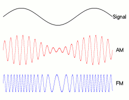

# 编码与调制

> 参考[湖科大教书匠计算机网络微课堂](https://www.bilibili.com/video/BV1c4411d7jb?p=17&vd_source=7dc2d8cc8f3730d0c9e372b2b2a8bff2)

在通信系统中，数据可以分为模拟数据和数字数据。信号是数据的具体表现形式，它可以是模拟信号，也可以是数字信号。将数据转换为模拟信号的过程称为**调制**，将数据转换为数字信号的过程称为编码。

数字数据可通过数字发送器转换为数字信号传输，也可通过调制器转换成模拟信号传输；同样，模拟数据可通过PCM编码器转换成数字信号传输，也可通过放大器调制器转换成模拟信号传输。这样，就形成了如下4种编码与调制方式。

## 1. 模拟数据的模拟调制

模拟数据的模拟调制是指将模拟数据通过调制器转换为模拟信号进行传输的过程。为了实现传输的有效性，可能需要较高的频率，并且这种调制方式还可以使用频分复用(FDM)技术，充分利用带宽资源。

这种方式的优点是技术相对成熟，实现简单，但缺点是信号容易受噪声影响，信号衰减和干扰会明显影响接收质量。

## 2. 模拟数据的数字编码

**模拟数据的数字编码** 是将模拟数据转换为数字信号的过程。这一过程通常包括采样、量化和编码三个步骤，常用于对音频信号进行编码的PCM编码。

1. **采样 (Sampling)**：对模拟信号在时间轴上进行定时采样，将连续的模拟信号离散化为一系列时间点的信号值。根据奈奎斯特定理，采样频率必须大于或等于模拟信号最大频率的两倍。
2. **量化 (Quantization)**：将采样得到的离散电平幅值按照一定的分级标度转换为对应的数值并取整，这样就将连续的电平幅值转换为离散的数字量。采样和量化的实质就是分割和转换。
3. **编码 (Encoding)**：将量化后的信号值转换为数字码字，通常是二进制码。这种数字码字可以用来表示原始的模拟数据。

采样定理(奈奎斯特定理)：在将模拟信号转换成数字信号时，假设原始信号中的最大频率为\\(f\\)，那么采样率必须大于或等于最大频率\\(f\\)的2倍，才能保证采样后的数字信号完整保留原模拟信号的信息 。

数字编码后的信号可以传输在数字信道中，常见的应用场景包括音频信号的数字化（如PCM）和图像信号的数字化。

## 3. 数字数据的模拟调制



**数字数据的模拟调制** 是将数字数据转换为模拟信号的过程，常用于将数字数据传输在模拟信道中。常见的调制方式有：

- **ASK (Amplitude Shift Keying, 幅移键控)**：也叫调幅(AM)，通过改变载波的幅度来表示数字数据。常见的二进制ASK中，0和1分别对应两种不同的载波幅度。**这种方式抗干扰能力较差**。

- **FSK (Frequency Shift Keying, 频移键控)**：也叫调频(FM)，通过改变载波的频率来表示数字数据。常见的二进制FSK中，0和1分别对应两种不同的载波频率。这种方式容易实现，抗干扰能力强，应用广泛。

- **PSK (Phase Shift Keying, 相移键控)**：也叫调相(PM)，通过改变载波的相位来表示数字数据。常见的二进制PSK中，0和1分别对应两种不同的载波相位。

> PSK（相移键控）是一种通过改变载波相位来表示数字数据的调制方式。常见的二进制PSK（BPSK）中，数字信号“0”和“1”分别对应两种不同的载波相位。PSK 是一种广泛使用的数字调制技术，具有抗干扰能力强、频谱利用率高等优点。其分为绝对调相（Absolute Phase Shift Keying）和相对调相（Differential Phase Shift Keying, DPSK）两种形式。
>
> 绝对调相是 PSK 的一种形式，其中载波的相位直接与数字数据的状态关联。在二进制 PSK (BPSK) 中，这通常意味着“0”和“1”分别对应于载波的两个固定相位（例如，0 度和 180 度）。每次调制时，载波的相位都会根据当前的数字数据位切换到相应的固定相位。绝对调相的特点是相位变化直接对应数据位的值，因此解调器通过检测当前载波的绝对相位即可恢复原始数据。绝对调相由于其实现简单、易于理解的特点，常用于一些基本的通信系统中，如无线电通信和低速数据传输。
>
> 相对调相（也称为差分相移键控，DPSK）是 PSK 的另一种形式，其中数字数据通过载波相位的变化相对于前一比特的相位进行编码。换句话说，当前的数字数据位“0”或“1”决定了载波相位相对于上一比特相位的增量。这样，相位的变化而非绝对相位用于表示数据。
>
> - **DPSK示例**：
>   - “0”表示载波相位与上一比特相位相同。
>   - “1”表示载波相位相对于上一比特相位变化 180 度。
>
> 相对调相的优势在于，在接收端不需要同步载波，因为解调只需要检测相邻比特之间的相位差异，而不是绝对相位。相对调相更适用于环境噪声较大的场合或移动通信中。DPSK 常用于无线通信和卫星通信中，特别是在信道容易受到多径效应和相位抖动影响的场景下。

- **QAM (Quadrature Amplitude Modulation, 正交幅度调制)**：通过同时改变载波的幅度和相位来表示数字数据。QAM结合了ASK和PSK的特点，具有更高的频谱效率，常用于现代通信系统，如无线通信和有线调制解调器。

> 设波特率为B，采用m个相位，每个相位有n种振幅，则该QAM的数据传输速率R为
> \\[
> R=B*log_2(mn)
> \\]

## 4. 数字数据的数字编码

**数字数据的数字编码** 是指将数字数据转换为另一种形式的数字信号，通常为了适应传输信道的要求或提高传输效率。常见的编码方式有以下几种，如图：

### (1)归零编码 (Return to Zero, RZ)

归零编码是一种信号编码方式，在每个比特周期内信号都会返回到零电平（归零）。在 RZ 编码中，每个比特周期分为两个部分：

- **高电平**：表示“1”时，信号在比特周期的前半部分为高电平，后半部分返回到零电平。
- **低电平**：表示“0”时，信号在比特周期的前半部分为低电平，后半部分返回到零电平。

RZ 编码的优点包括：

- **同步性强**：由于信号在每个比特周期内都会返回到零电平，接收器能够通过检测信号的回归位置实现自同步。
- **直流分量低**：信号在每个比特周期内返回零电平，减少了直流分量的出现。

缺点：

- **带宽占用高**：由于归零部分占用一部分带宽，信号频繁变化，带宽需求较高。

### (2)非归零编码 (Non-Return to Zero, NRZ)

非归零编码是一种简单的数字编码方式，其中数字数据直接映射为高低电平，而没有中间的归零状态，因此NRZ编码的收发双方存在同步问题，为此需要双方都带有时钟同步线。NRZ 信号在比特周期内保持恒定电平，表示“1”和“0”时，信号分别为高电平和低电平。

- **NRZ-L（NRZ-Level）**：最常见的 NRZ 编码方式，“1” 对应高电平，“0” 对应低电平。
- **NRZ-I（NRZ-Inverted）**：表示“1”时信号电平发生变化，表示“0”时信号电平保持不变。

优点：

- **带宽效率高**：由于信号不需要频繁变化，带宽利用效率较高。

缺点：

- **同步性差**：长时间的连续“1”或“0”可能导致接收器失去同步。
- **直流分量大**：连续的“1”或“0”可能导致较大的直流分量。

### (3)反向非归零编码 (NRZI, Non-Return to Zero Inverted)

反向非归零编码（NRZI）是一种通过电平变化而非绝对电平来表示数据位的编码方式。它是对传统 NRZ 编码的一种改进，旨在增强信号的同步性和抗干扰性。NRZI 编码的关键特征在于它并不直接用高低电平表示“1”或“0”，而是通过电平是否翻转来表示比特值。

- **表示“1”**：在 NRZI 编码中，数据位“1”表示信号电平在当前比特周期的起始位置发生翻转（即从高电平变为低电平，或从低电平变为高电平）。
- **表示“0”**：数据位“0”表示信号电平在当前比特周期的起始位置保持不变（即电平与前一个比特周期的结束电平相同）。

优点：

- **提高同步性**：由于“1”会引起电平变化，即使是长时间的连续“0”也不会导致同步丢失。接收器可以通过检测信号的变化来保持同步。
- **抗干扰能力强**：电平变化比绝对电平更容易在噪声环境中识别，从而增强了抗干扰能力。

缺点：

- **复杂性略高**：与传统的 NRZ 编码相比，NRZI 编码和解码的过程稍微复杂，因为它依赖于前一个比特的电平状态。
- **依赖初始状态**：NRZI 编码的结果取决于初始电平状态，因此初始电平的选择可能影响整个序列的编码。

NRZI 编码广泛应用于需要高可靠性和抗干扰能力的通信系统中。它常见于磁带存储、光纤通信和 USB 协议等场景。NRZI 编码特别适合那些信号恢复难度较大的环境，因为它可以通过电平变化简化信号的检测和恢复过程。

### (4)曼彻斯特编码 (Manchester Encoding)

曼彻斯特编码是一种自同步的数字信号编码技术，广泛应用于通信系统中，尤其是在以太网标准中。曼彻斯特编码通过在每个比特周期内产生一次电平跳变，利用跳变的位置来表示比特值。由于每个比特周期内都有一个电平变化，这种编码方式能够提供强大的自同步能力，并且不会产生直流分量。

曼彻斯特编码通过以下方式来表示数字数据：

- **表示“1”**：在比特周期的中间位置，信号从低电平跳变到高电平。这意味着，在一个完整的比特周期内，前半周期是低电平，后半周期是高电平。
- **表示“0”**：在比特周期的中间位置，信号从高电平跳变到低电平。在一个完整的比特周期内，前半周期是高电平，后半周期是低电平。

优点：

- **自同步能力**：由于每个比特周期内都会发生一次跳变，接收器可以通过检测跳变位置来保持与发送器的同步。这种自同步特性使得曼彻斯特编码在不需要额外的同步信号的情况下，也能实现精确的数据传输。
- **无直流分量**：每个比特周期内都包含高电平和低电平，信号的平均电平接近于零，这消除了直流分量的产生。无直流分量的特性使得曼彻斯特编码在长距离传输中更加稳定。

缺点：

- **带宽需求高**：由于曼彻斯特编码每个比特周期内有两次电平变化，实际传输的波形频率是原始数据速率的两倍。这意味着相比于其他编码方式，曼彻斯特编码需要更高的带宽来传输相同的数据量。

### (5)差分曼彻斯特编码 (Differential Manchester Encoding)

差分曼彻斯特编码是一种基于曼彻斯特编码的变体，进一步增强了抗干扰能力和同步性。与曼彻斯特编码不同的是，差分曼彻斯特编码并不直接通过电平高低来表示数据位，而是通过相邻比特周期内的电平变化方向来编码数据。这种编码方式在信道质量较差或容易受到干扰的通信环境中表现出色。

差分曼彻斯特编码的编码规则如下：

- **跳变位置**：每个比特周期的中间位置总是发生一次跳变，确保信号的自同步能力。
- **表示“1”**：如果当前比特是“1”，信号在比特周期的起始位置不发生电平翻转，即电平保持与上一个比特周期的结束电平相同。
- **表示“0”**：如果当前比特是“0”，信号在比特周期的起始位置发生电平翻转，即电平与上一个比特周期的结束电平相反。

优点：

- **抗干扰能力强**：由于编码依赖于相邻比特周期间的电平变化，而非绝对电平，差分曼彻斯特编码在噪声较大的环境中更具优势。如果传输过程中发生了电平反转错误，影响仅限于当前比特，不会扩散到后续比特。
- **自同步能力**：与曼彻斯特编码类似，差分曼彻斯特编码在每个比特周期中都有一次跳变，这种特性保证了信号的自同步能力。

缺点：

- **带宽需求高**：差分曼彻斯特编码与曼彻斯特编码一样，实际传输的频率是原始数据速率的两倍，因此需要较高的带宽来传输相同的数据量。
