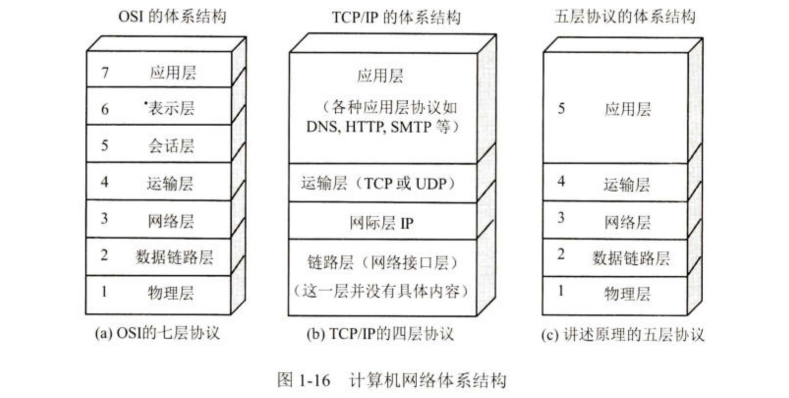

# ISO / OSI参考模型和TCP / IP模型

OSI的七层协议体系结构的概念清楚，理论也较完整，但它既复杂又不实用。TCP/IP体系结构则不同，它现在得到了非常广泛的应用。TCP/IP 是一个四层的体系结构，它包含应用层，运输层，网际层和链路层 (网络接口层)。用网际层这个名字是强调本层解决不同网络的互连间题。在互联网的标准文栏[RFC 1122, STD3]中，体系结构中的底层叫作链路层，但接着又说明了链路层就是媒体接入层。但也有把链路层称为网络接口层的[COME06]或子网层的[PETE12]。从实质上讲，TCP/IP只有最上面的三层，因为最下面的链路层并没有属于 TCP/IP 体系的具体协议。链路层所使用的各种局域网标准，并非由IETF而是由IEEE的802委员会下属的各工作组负责制定的。在讲授计算机网络原理时往往采取另外的办法，即综合OSI和TCP/IP的优点，采用如图所示的五层协议的体系结构，这对阐述计算机网络的原理是十分方便的。

## 1. OSI参考模型

国际标准化组织 (ISO) 提出的网络体系结构模型称为开放系统互连参考模型 (OSI/RM)，通常简称为OSI参考模型。OSI参考模型有 7层，自下而上依次为物理层，数据链路层，网络层，传输层，会话层，表示层，应用层。低三层统称通信子网，是为联网而附加的通信设备，完成数据的传输功能：高三层统称资源子网，相当于计算机系统，完成数据的处理等功能。传输层承上启下。

| 层级  | 名称                 | 功能描述                                                                                                                                              | 常见协议/技术                        | 数据单位         |
|-------|----------------------|-------------------------------------------------------------------------------------------------------------------------------------------------------|--------------------------------------|------------------|
| 7     | 应用层 (Application)  | 提供网络服务给用户应用程序，如文件传输、电子邮件、远程登录等。                                                                                        | HTTP, FTP, SMTP, DNS                 | 数据 (Data)      |
| 6     | 表示层 (Presentation) | 负责数据格式的转换、加密解密、数据压缩等工作，确保数据在应用层可以被正确理解。                                                                          | SSL/TLS, JPEG, MPEG                  | 数据 (Data)      |
| 5     | 会话层 (Session)      | 管理应用程序之间的会话，负责建立、管理和终止会话，支持对话控制和数据同步。                                                                              | RPC, NetBIOS, PPTP                   | 数据 (Data)      |
| 4     | 传输层 (Transport)    | 提供端到端的数据传输服务，确保数据包的完整性与顺序，支持流量控制、差错检测与纠正。                                                                      | TCP, UDP                             | 段 (Segment)     |
| 3     | 网络层 (Network)      | 负责数据包的路由选择和转发，通过逻辑地址（如IP地址）将数据包从源节点发送到目的节点，可能跨越多个网络。                                                 | IP, ICMP, OSPF, BGP                  | 数据包 (Packet)  |
| 2     | 数据链路层 (Data Link)| 负责将数据封装成帧，并提供物理地址（MAC地址）的访问和控制，确保数据帧的无误传输，处理错误检测和纠正。                                                 | Ethernet, PPP, MAC                   | 帧 (Frame)       |
| 1     | 物理层 (Physical)     | 定义了物理设备的标准，如电缆、信号、电压等，负责比特流在物理介质上的传输。                                                                             | 光纤, 同轴电缆, RJ-45, USB           | 比特 (Bit)       |

### (1)物理层

物理层的传输单位是**比特**，功能是在物理介质上为数据端设备透明地传输原始比特流。物理层主要研究：

1. 通信链路与通信节点的连接的电路接口的参数，如机械形状和尺寸、引脚的数量和排列等，例如Rj45网线接口。
2. 物理层规定了通信链路上所传输的信号的意义与电气特征，例如指定某种信号的表示为0或1,这种信号可以是高低电平或其他信号。

物理层协议并不包括例如双绞线、光缆与无线介质等物理介质，这些传输介质在物理层协议下面，因此有人将物理介质当作第0层。

### (2)数据链路层

数据链路层的传输单位是**帧**。两台主机之间的数据传输总是在一段一段的链路上进行的，这就需要使用专门的链路层协议。主要作用是加强物理层传输原始比特流的功能，将物理层提供的可能出错的物理连接改造为逻辑上无差错的数据链路。数据链路层将网络层交来的IP分组封装成帧，并且可靠地传输到相邻节点的网络层，实现节点之间的**差错控制**和**流量控制**的功能。

广播式网络在数据链路层还要处理新的问题，即如何控制对共享信道的访问(例如无线局域网)。

### (3)网络层

网络层的传输单位是**数据报**，它关心的是通信子网的运行控制，主要任务是将网络层的协议数据单元(分组)从源主机传输到目的主机，为分组交换网上的不同主机提供通信服务。关键问题是对分组进行路径选择，并实现流量控制、拥塞控制、差错控制和网际互联等功能。网络层既提供有连接可靠的虚电路服务，又提供无连接不可靠的数据报服务。

工作在网络层的路由器进行转发工作时，会根据网络情况，利用相应的路由算法选择出一条合适的路径。

### (4)传输层

传输层也称为运输层，负责主机两个进程之间的通信，提供端到端的流量控制、差错控制、连接建立与释放、可靠传输管理等服务，传输层仅提供有连接可靠的服务。

数据链路层提供的是点对点的通信，即主机到主机之间的通信，而网络层提供的是端到端的通信，即运行在两个主机上的不同进程之间的通信，两者不同。

通过传输层的屏蔽，高层用户看不到通信子网的交替与变化。因为一台主机可同时运行多个进程，所以传输层具有**复用和分用**的功能。复用是指多个应用层进程可同时使用下面传输层的服务，分用是指传输层将收到的信息分别交付给上面应用层中相应的进程。

> 在OSI参考模型中，数据链路层、网络层、传输层都有流量控制的功能，但三层侧重点各有不同：
>
> 1. 数据链路层是相邻节点间的流量控制
> 2. 网络层是整个网络中的流量控制
> 3. 传输层是端到端的流量控制
>

### (5)会话层

会话层允许不同主机上的各个进程之间进行会话。这种服务主要为表示层实体或用户进程建立连接，并在连接上有序的传输数据，这就是会话，也称**建立同步**(SYN)。会话层负责管理主机间的会话进程。包括建立、管理和终止进程间的会话。会话层包含一种称为**检查点**的机制来维持可靠会话，使通信会话在通信失效时从检查点继续恢复通信，即断点下载的原理。

### (6)表示层

表示层主要处理在不同主机中交换信息的表示方式。不同机器采用的编码和表示方式不同，为了使不同表示方法的数据和信息之间能够互相交换，表示层采用抽象的标准方法定义数据结构，并采用标准的编码方式。此外，数据压缩、加密和解密也是表示层的功能。

### (7)应用层

应用层是OSI参考模型的最高层，是用户与网络的接口。应用层为特定类型的网络应用提供访问OSI参考模型环境的手段。用户的实际应用多种多样，这就要求应用层采用不同的应用协议来满足不同类型的应用要求，因此应用层是最复杂的一层，使用的协议也最多。

## 2. TCP/IP模型

TCP/IP因为得到广泛的应用而成为事实上的国际标准。

IP是互联网中的核心协议，TCP/IP可以为各式各样的应用提供服务(即everything over IP)，TCP/IP还允许IP在各种网络构成的互联网上运行(所谓IP over everything)。

| 层级  | 名称                         | 功能描述                                                                                                                                                  | 常见协议/技术                         | 数据单位         |
|-------|------------------------------|-----------------------------------------------------------------------------------------------------------------------------------------------------------|---------------------------------------|------------------|
| 4     | 应用层 (Application Layer)    | 提供应用程序之间的通信服务，涵盖了OSI模型中的应用层、表示层和会话层的功能。支持各种应用协议如HTTP、FTP、DNS、SMTP等。                                      | HTTP, FTP, SMTP, DNS, SSH, Telnet     | 数据 (Data)      |
| 3     | 传输层 (Transport Layer)      | 负责端到端的数据传输，确保数据的可靠性和顺序传递。提供流量控制、差错检测与纠正。主要协议有TCP和UDP。                                                       | TCP, UDP                              | 段 (Segment)     |
| 2     | 网络层 (Internet Layer)       | 负责逻辑地址的处理（如IP地址），数据包的路由选择和转发。确保数据包能够跨越不同的网络到达目的地。对应OSI模型中的网络层。                                      | IP, ICMP, ARP, RIP, OSPF, BGP         | 数据包 (Packet)  |
| 1     | 网络接口层 (Network Interface Layer) | 处理数据链路层和物理层的功能，负责将数据帧通过物理介质进行传输。确保数据在同一局域网或链路上传输，包含数据帧的封装、地址访问和物理传输。                            | Ethernet, Wi-Fi, Token Ring, PPP      | 帧/比特 (Frame/Bit) |

### (1)网络接口层

网络接口层的功能类似于OSI参考模型的的物理层和数据链路层，其作用是从主机或节点接受IP分组，并将它们发送到指定的物理网络上。但TCP/IP并未具体描述网络接口层的功能和协议，只是指出主机必须使用某种协议与网络连接，以便在其上传送IP分组。具体的物理网络可以是各种类型的局域网，如以太网、令牌环网等，又可以是电话网、ATM等公共数据网络。

### (2)网际层

网际层(主机-主机)是TCP/IP体系结构的关键部分，功能上它与OSI参考模型的网络层非常相似。网际层将分组发往任何网络，并为其独立地选择合适的路由，但不保证各个分组有序地到达，各个分组的有序和可靠交付由高层负责。网际层仅提供无连接不可靠的IP，数据传输的单位是**IP数据报**。当前采用的普遍是IPV4，下一版本是IPV6。

### (3)传输层

传输层(应用-应用或进程-进程)的功能同样与OSI参考模型中的传输层类似，即使得发送端和目的端主机上的对等实体进行会话。

传输层主要使用以下两种协议：

1. 传输控制协议(Transmission Control Protocol, TCP)。它是面向连接的，传输数据之前必须先建立连接，能够进行可靠的交付。数据传输的单位是**报文段**。
2. 用户数据报协议(user Datagram Protocol, UDP)。它是无连接的，不保证提供可靠的交付，只能“尽最大努力交付”。数据传输的基本单位是**用户数据报**。

### (4)应用层

应用层(用户-用户)包含所有的高层协议，如虚拟终端协议(Telnet)、文件传输协议(FTP)、域名解析服务(DNS)、电子邮件协议(SMTP)和超文本传输协议(HTTP)

## 3. TCP/IP模型与OSI参考模型的比较

相似之处：

1. 二者都分层
2. 二者都基于独立的协议栈的概念
3. 二者都解决异构网络的互联

不同之处：

1. OSI精确定义了协议、服务、接口，而TCP/IP模型没有加以区分
2. OSI有七层，而TCP/IP只有四层，进行了一些层的合并与逻辑简化
3. OSI先有模型，后有协议规范，通用性良好，适合描述各种网络。而TCP/IP模型恰好相反，即先有协议栈，后建立模型，因此不适用于其他的任何非TCP/IP的网络。
4. OSI参考模型在网络层支持有连接和无连接的通信，而在传输层仅有面向连接的通信。而TCP/IP模型则认为可靠性是端到端的问题，因此它在网际层仅有一种无连接的通信模式。但传输层支持无连接和面向连接的两种模式。

## 4. 结合两种模型的五层参考模型

在学习中我们往往采取折中的想法，即结合OSI参考模型和TCP/IP模型的5层模型，如下表所示：

| 层级  | 名称                 | 对应OSI模型的层级                     | 对应TCP/IP模型的层级                | 功能描述                                                              |
|-------|----------------------|---------------------------------------|-------------------------------------|-----------------------------------------------------------------------|
| 5     | 应用层 (Application)  | 应用层、表示层、会话层                | 应用层                              | 提供各种网络服务与应用程序的交互。                                      |
| 4     | 传输层 (Transport)    | 传输层                               | 传输层                              | 提供端到端的数据传输服务，确保数据完整性与可靠传递。                     |
| 3     | 网络层 (Network)      | 网络层                               | 网络层                              | 负责逻辑地址的处理与路由选择，确保数据包到达正确的目的地。               |
| 2     | 数据链路层 (Data Link)| 数据链路层                           | 网络接口层                          | 负责数据帧的封装与传输，处理物理地址的访问与控制。                       |
| 1     | 物理层 (Physical)     | 物理层                               | 网络接口层                          | 处理数据在物理介质上的传输，如电缆和信号。                               |
