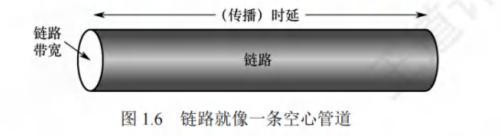

# 计算机网络的主要性能指标

性能指标从不同方面度量计算机网络的性能。常用的性能指标如下。

1. 速率(Speed)。指连接到网络上的结点在数字信道上传送数据的速率，也称数据传输速率、数据传输率、数据率或比特率，单位为b/s(比特/秒)或bit/s(有时也写为bps)。当数据率较高时，可用kb/s(k=10)、Mb/s (M=10)或Gb/s(G=10)表示。
2. 带宽(Bandwidth)。带宽原本表示通信线路允许通过的信号频率范围，单位是赫兹(Hz)。但在计算机网络中，带宽表示网络的通信线路所能传送数据的能力，是数字信道所能传送的“最高数据传输速率”的同义语，单位是比特/秒(b/s)。
3. 吞吐量(Throughput)。指单位时间内通过某个网络(或吐量)常用在对实际网络的测量中，受网络带宽的限制。
4. 时延(Delay)。指数据(一个报文或分组)从网络(或链路)的一端传送到另一端所需的总时间，它由4部分构成：发送时延、传播时延、处理时延和排队时延。
5. 时延带宽积。指发送端发送的第一个比特即将到达终点时，发送端已发出了多少比特，又称以比特为单位的链路长度，即时延带宽积=传播时延x信道带宽。如下图所示，考虑一个代表链路的圆柱形管道，其长度表示链路的传播时延，横截面积表示链路带宽，则时延带宽积表示该管道可以容纳的比特数量。

6. 往返时延(Round-Trip Time，RTT)。指从发送端发出一个短分组，到发送端收到来自接收端的确认(接收端收到数据后立即发送确认)总共经历的时延。在互联网中，往返时延还包括各中间结点的处理时延、排队时延及转发数据时的发送时延。
7. 信道利用率。用以指出某个信道有百分之多少的时间是有数据通过的。
信道利用率=有数据通过时间/(有+无)数据通过时间

> 分组交换网中各种时延的计算(2010、2013、2023)
>
> - 发送时延，也称传输时延。结点将分组的所有比特推向链路所需的时间，即从发送分组的第一个比特算起，到该分组的最后一个比特发送完毕所需的时间。
>
> 发送时延=分组长度/发送速率
>
> - 传播时延。电磁波在信道(传输介质)中传播一定的距离所花的时间，即一个比特从链路的一端传播到另一端所需的时间。
>
> 传播时延=信道长度/电磁波在信道上的传播速率
>
> 区分传输时延和传播时延。传输时延是路由器将分组推出所需的时间，是分组长度和链路谕速率的函数。传播时延是一个比特从一台路由器传播至另一台路由器所需的时间，是两台由器之间距离的函数，而与分组长度或链路传输速率无关。
>
> - 处理时延。数据在交换结点为存储转发而进行的一些必要处理所花的时间。例如，分析分组的首部、从分组中提取数据、差错检验或查找合适的路由等。
> - 排队时延。分组在进入路由器后要先在输入队列中排队等待处理。路由器确定转发端口后，还要在输出队列中排队等待转发。这就产生了排队时延。因此，数据在网络中经历的总时延就是以上4部分时延之和：
> 总时延=发送时延+传播时延+处理时延+排队时延
>
> 处理时延和排队时延通常可忽略不计(除非另有说明)。
