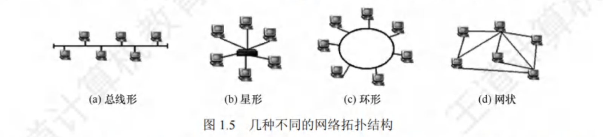

# 计算机网络的分类

## 1. 按分布范围分类

1. 广域网(WAN)。广域网的任务是提供长距离通信，运送主机所发送的数据，其覆盖范围通常是直径为几十到几千千米的区域。广域网是互联网的核心部分。连接广域网的各结点交换机的链路一般都是高速链路，具有较大的通信容量。
2. 城域网(MAN)。城域网的覆盖范围可以跨越几个街区甚至整个城市，覆盖区域的直径为5~50km。城域网大多采用以太网技术，因此有时也常并入局域网的范围讨论。
3. 局域网(LAN)。局域网一般用主机通过高速线路相连，覆盖范围较小，通常是直径为几十到几千米的区域。传统上，局域网使用广播技术，而广域网使用交换技术。
4. 个人区域网(PAN)。个人区域网是指在个人工作的地方将消费电子设备(如平板电脑、智能手机等)用无线技术连接起来的网络，也称无线个人区域网(WPAN)。

## 2. 按传输技术分类

1. 广播式网络。所有联网计算机都共享一个公共通信信道。当一台计算机利用共享通信信道发送报文分组时，所有其他计算机都会“收听”到这个分组。接收到该分组的计算机将通过检查目的地址来决定是否接收该分组。局域网基本上都采用广播式通信技术，广域网中的无线、卫星通信网络也采用广播式通信技术。
2. 点对点网络。每条物理线路连接一对计算机。若通信的两台主机之间没有直接连接的路，则它们之间的分组传输就要通过中间结点进行存储和转发，直至目的结点。

## 3. 按拓扑结构分类

网络拓扑结构是指由网中结点(路由器、主机等)与通信线路之间的几何关系表示的网络主要指通信子网的拓扑结构。按网络的拓扑结构，可分为总线形、星形、环形和网状网络等。如下图所示。星形、总线形和环形网络多用于局域网，网状网络多用于广域网。

1. 总线形网络。用单根传输线把计算机连接起来。优点是建网容易、增/减结点方便、节省线路。缺点是重负载时通信效率不高、总线任意一处对故障敏感。
2. 星形网络。每个终端或计算机都以单独的线路与中央设备相连。中央设备一般是交换机或路由器。优点是便于集中控制和管理。缺点是成本高、中央设备对故障敏感。
3. 环形网络。所有计算机接口设备连接成一个环。环形网络最典型的例子是令牌环局域网。环既可以是单环，又可以是双环，环中信号是单向传输的。
4. 网状网络。一般情况下，每个结点至少有两条路径与其他结点相连，多用在广域网中。其有规则型和非规则型两种。优点是可靠性高。缺点是控制复杂、线路成本高。

以上4种基本的网络拓扑结构可以互连为更复杂的网络。

## 4. 按使用者分类

1. 公用网(Publie Network)。指电信公司出资建造的大型网络。“公用”的意思是指所有愿意按电信公司的规定缴纳费用的人都可使用这种网络。
2. 专用网(Private Network)。指某个部门为满足本单位特殊业务的需要而建造的网络。这种网络不向本单位外的人提供服务,如铁路、电力、军队等部门的专用网。

## 5. 按传输介质分类

传输介质可分为有线和无线两大类，因此网络可分为有线网络和无线网络。有线网络又可分双绞线网络、同轴电缆网络等，而无线网络又可分为蓝牙、微波、无线电等类型。
