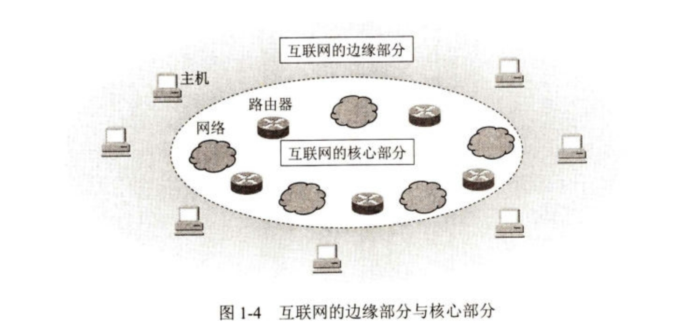

# 计算机网络的定义、组成与功能

## （一）计算机网络的定义

一般认为，计算机网络是一个将众多分散的、自治的计算机系统，通过通信设备与线路连接起来，由功能完善的软件实现资源共享和信息传递的系统。

### 1. 计算机网络(简称网络)

由若干**结点**(node，或译为节点)和连接这些结点的**链路**(link)组成。网络中的结点可以是计算机、集线器、交换机或路由器等。

### 2. internet(互连网)

是一个通用名词，泛指由多个计算机网络互连而成的计算机网络。计算机网络之间可通过路由器互连，构成一个覆盖范围更广的计算机网络，这样的网络称为互连网(internet)，因此互连网通常被称为网络的网络。计算机网络把许多计算机连在一起，而互连网则把许多网络通过路由器连在一起。组成互连网的计算机网络之间可以使用**任意的通信协议**作为通信规则，不一定非要使用 TCP/IP 协议。

### 3. Internet(互联网或因特网)

是一个专用名词，指当前全球最大的、开放的、由众多网络和路由器互连而成的特定计算机网络，它采用 **TCP/IP** 协议族作为通信规则。

因此，(计算机)网络把许多计算机连接在一起，而互连网(internet)则把许多网络通过一些路由器连接在一起。与网络相连的计算机常称为主机。互联网(Internet)是全球性的也是最大范围的互连网。

## （二）计算机网络的组成

从不同的角度看，可以将计算机网络看成不同的组成。

### 1. 从组成部分看

计算机网络主要由**硬件**、**软件**、**协议**三大部分组成。

硬件主要由主机(也称端系统)、通信链路(如双绞线、光纤)、交换设备(如路由器、交换机等)和通信处理机(如网卡)等组成。

软件主要包括各种实现资源共享的软件和方便用户使用的各种工具软件(如E-mail 程序、FTP程序、聊天程序等)。

协议是计算机网络的核心，如同交通规则制约汽车驾驶一样，协议规定了网络传输数据时所遵循的规范。

### 2. 从工作方式看

> 课本p9-p12详细介绍了计算机网络的边缘部分，其中着重强调了端系统之间的两种通信方式，p12-p17着重介绍了计算机网络的核心部分以及介绍了三种交换方式的不同，三种交换方式的介绍放在后文第（五）部分中介绍。

计算机网络(这里主要指 Internet，即互联网)可分为**边缘部分**和**核心部分**。

**边缘部分**由所有连接到互联网上的供用户直接使用的主机组成，用来进行**通信(如传输数据、音频或视频)和资源共享**。

在网络边缘的端系统之间的通信方式通常可划分为两大类：客户-服务器方式(C/S方式)和对等方式(P2P方式)。

**核心部分**由大量网络和连接这些网络的路由器组成，它为边缘部分**提供连通性和交换服务**。

网络核心部分是互联网中最复杂的部分，因为网络中的核心部分要向网络边缘部分中的大量主机提供连通性，使边缘部分中的任何一台主机都能够与其他主机通信。

在网络核心部分起特殊作用的是**路由器**(router)，它是一种专用计算机(但不叫作主机)。路由器是实现**分组交换**(packet switching)的关键构件，其任务是转发收到的分组，这是网络核心部分最重要的功能。

### 3. 从功能组成上看

计算机网络由**通信子网**和**资源子网**组成。

通信子网由各种传输介质、通信设备和相应的网络协议组成，它使网络具有数据传输、交换、控制和存储的能力，实现联网计算机之间的数据通信。

资源子网是实现资源共享功能的设备及其软件的集合，向网络用户提供共享其他计算机上的硬件资源、软件资源和数据资源的服务。

## （三）计算机网络的功能

计算机网络的功能很多，现今的很多应用都与网络有关，主要有以下五大功能。

### 1. 数据通信

数据通信是计算机网络最基本和最重要的功能，用来实现联网计算机之间各种信息的传输，并联系分散在不同地理位置的计算机，进行统一的调配、控制和管理。例如，文件传输、电子邮件等应用，离开了计算机网络就无法实现。

### 2. 资源共享

资源共享既可是软件共享、数据共享受又可是硬件共享，它使计算机网络中的资源互通有无、分工协作，从而极大地提高了硬件资源、软件资源和数据资源的利用率。

### 3. 分布式处理

当计算机网络中的某个计算机系统负荷过重时，可将其处理的某个复杂任务分配给网络中的其他计算机系统，从而利用空闲计算机资源来提高整个系统的利用率。

### 4. 提高可靠性

计算机网络中的各台计算机可以通过网络互为替代机。

### 5. 负载均衡

将工作任务均衡地分配给计算机网络中的各台计算机。

除了以上几大主要功能，计算机网络还可实现电子化办公与服务、远程教育、娱乐等功能，满足了社会的需求，方便了人们的学习、工作和生活，具有巨大的经济效益。

## （四）互联网的基本特点

### 1. 连通性

所谓连通性(connectivity)，就是互联网使上网用户之间，不管相距多远(例如，相距数千公里)，都可以非常便捷、非常经济地(在很多情况下甚至是免费的)交换各种信息(数据，以及各种音频、视频)，好像这些用户终端都彼此直接连通一样。这与使用传统的电信网络有着很大的区别。我们知道,传统的电信网向用户提供的最重要的服务就是人与人之间的电话通信，因此电信网也具有连通性这个特点。但使用电信网的电话用户，往往要为此向电信网的运营商缴纳相当昂贵的费用，特别是长距离的越洋通信。但应注意，互联网具有虚拟的特点。例如，当你从互联网上收到一封电子邮件时，你可能无法准确知道对方是谁(朋友还是骗子)，也无法知道发信人的地点(在附近，还是在地球对面)。

### 2. 共享

所谓共享就是指资源共享。资源共享的含义是多方面的，可以是信息共享、软件共享，也可以是硬件共享。例如，互联网上有许多服务器(就是一种专用的计算机)存储了大量有价值的电子文档(包括音频和视频文件)，可供上网的用户很方便地读取或下载(无偿或有偿)。由于网络的存在，这些资源好像就在用户身边一样，使用非常方便。
